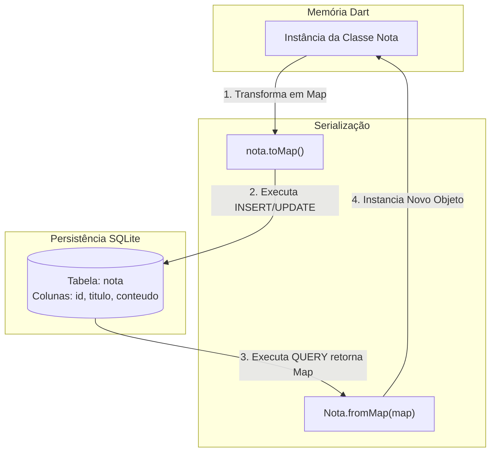
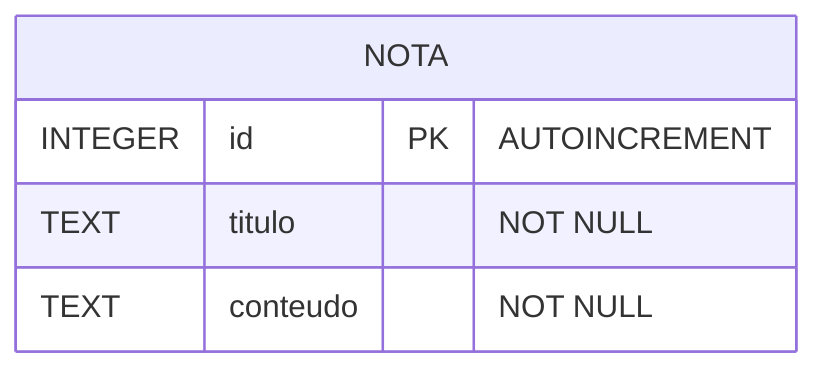

# sqflite_exemplo

## Arquitetura e Modelagem: Módulo de Persistência Local (Armazenamento Local)

Este projeto descreve as decisões de modelagem de dados e fluxo de peristência local utilizando o pacote ``sqflite` integrado ao ecossistema Flutter.

## 1. Mapeamento Objeto-Relacional (ORM)

O `sqflite` se comunica nativamente com dados estruturas na forma de pares de linha/coluna (`Map`<String, dynamic>`). Abaixo o diagrama ilustra o ciclo de vida e a transformação sofrida pelo dado desde a memória da aplicação (Objeto) até o disco de armazenamento (Tabela SQLite).

> Para ler o Mermaid via VS Code, instalar a extensão 'Markdown Preview Github Styling'

## Modelagem de Entidade e Relacionamento (MER)

O banco de dados SQLite armazena a estrutura da tabela utilizando restrições (constraints) e tipos primitivos de dados relacionais

