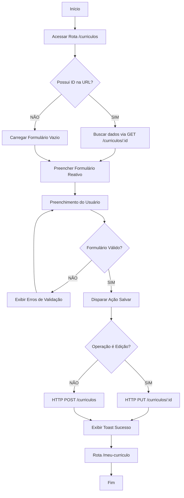

# Especificação de Requisitos de Software (SRS)
**Projeto:** Plataforma RH
**Versão:** 1.0
**Data:** 2 de Junho de 2026

## 1. Introdução
### 1.1 Propósito
Este documento descreve os requisitos funcionais e não funcionais para o Módulo de Currículos e Vagas da Plataforma de RH. O objetivo deste módulo é permitir que candidatos gerenciem suas informações profissionais e que a administração visualize esses dados.

### 1.2 Escopo
O sistema compreende o desenvolvimento de uma interface frontend em Angular integrada a um backend simulado (json-server). As funcionalidades incluem o CRUD completo de currículos, vinculação de dados por ID de usuário e interface administrativa para gestão.

## 2. Descrição Geral

### 2.1 Perspectiva do Produto

O Módulo de Currículos e Vagas é uma extensão da Plataforma de RH existente. Ele funciona de forma integrada ao sistema de autenticação (simulado), permitindo que candidatos criem um perfil profissional robusto. O ecossistema se apoia em uma arquitetura Single Page Application (SPA) com Angular no frontend que consome uma API REST simulada via json-server.

### 2.2 Funções do Produto

Para Candidatos: Permite o cadastramento de dados profissionais (formação, experiência, competências e links), alteração posterior dos dados e visualização do layout final do currículo.

Para Administradores / Empresas: Permite a listagem centralizada de todos os currículos cadastrados no banco de dados para triagem de talentos, além de permitir a exclusão de registros (moderação).

### 2.3 Características dos Usuários

Candidato: Usuário comum, busca simplicidade para preencher dados e clareza na visualização das suas informações.

Administrador (RH/Empresa): Usuário focado em análise operacional, necessita de listagens limpas e ferramentas rápidas de exclusão/atualização.

## 3. Requisitos do Sistema

### 3.1 Requisitos Funcionais (RF)

| ID | Descrição | Prioridade |
|:---|:----------|:-----------|
| RF01 | Criar Currículo: O sistema deve fornecer um formulário reativo para o candidato cadastrar formação, experiência, habilidades e LinkedIn. | Alta |
| RF02 | Vincular Usuário: Cada currículo salvo deve conter a propriedade usuarioId correspondente ao ID do usuário logado (simulado). | Alta |
| RF03 | Editar Currículo: O sistema deve permitir a alteração das informações de um currículo já existente através do método HTTP PUT. | Alta |
| RF04 | Visualizar Meu Currículo: O candidato deve ter uma tela exclusiva (/meu-curriculo) para checar seus dados estruturados. | Média |
| RF05 | Listar Currículos (Visão Empresa): O sistema deve exibir uma tabela ou lista com todos os currículos cadastrados para o perfil de Administrador. | Alta |
| RF06 | Excluir Currículo: O administrador deve ser capaz de remover um currículo da plataforma, deletando-o do arquivo db.json. | Média |
| RF07 | Validação de Campos: O formulário deve impedir o envio se campos obrigatórios (como nome, formação e experiência) não estiverem preenchidos. | Alta |

### 3.2 Requisitos Não-Funcionais (RNF)

| ID | Descrição | Categoria |
|:---|:----------|:-----------|
| RNF01 | Arquitetura Frontend: O sistema deve ser desenvolvido utilizando o framework Angular (versão estável recente), fazendo uso de FormBuilder e ReactiveFormsModule. | Tecnológico |
| RNF02 | Persistência de Dados: O backend deve ser simulado localmente através do pacote json-server rodando na porta 30XX. | Tecnológico |
| RNF03 | Comunicação Assíncrona: Toda a comunicação entre o Angular e o servidor mockado deve ser feita via HttpClientModule, utilizando Observables (RxJS). | Arquitetura |
| RNF04 | Interface e Usabilidade: A interface deve ser responsiva e utilizar preferencialmente componentes do Angular Material (MatCard, MatFormField, MatButton). | Usabilidade |
| RNF05 | Tempo de Resposta: Sendo um ambiente local (json-server), as requisições HTTP devem ser processadas e refletidas na tela em menos de 1 segundo. | Desempenho |
| RNF06 | Tratamento de Feedback: O usuário deve ser notificado visualmente de forma instantânea (via MatSnackBar ou alertas) após qualquer operação de escrita (POST, PUT, DELETE). | Usabilidade |

## 4. Interface de Dados e Modelagem do Sistema

### 4.1 Diagramas

#### 4.1.1 Diagrama de Uso

O diagrama abaixo demonstra o escopo de ações que o Candidato e o Administrador possuem dentro do Módulo de Currículos.

```mermaid
usecaseDiagram
    actor Candidato
    actor Administrador
    
    usecase UC01 as "Criar Currículo"
    usecase UC02 as "Editar Currículo"
    usecase UC03 as "Visualizar Meu Currículo"
    usecase UC04 as "Listar Currículos"
    usecase UC05 as "Excluir Currículo"
    usecase UC06 as "Validar Campos"
    
    Candidato --> UC01
    Candidato --> UC02
    Candidato --> UC03
    UC01 ..> UC06 : includes
    UC02 ..> UC06 : includes
    
    Administrador --> UC04
    Administrador --> UC05
```

#### 4.1.2 Diagrama de Classe (Modelagem de Interface TypeScript)

Representação da estrutura de dados (src/app/core/models/curriculo.model.ts) e do formato esperado no db.json:

```typescript
export interface Curriculo {
  id?: number;            // Gerado automaticamente pelo json-server
  usuarioId: number;      // ID do candidato vinculado
  nomeCompleto: string;
  formacao: string;
  experiencia: string;
  habilidades: string[];  // Array de competências
  linkedinUrl?: string;
}
```

#### 4.1.3 Diagrama de Fluxo (Ciclo de Vida do Formulário)

Fluxo lógico que o Angular executa ao interagir com a rota de cadastro e edição:



### Estrutura de Arquivos do Projeto

Organização atual dos arquivos do projeto:

```plaintext
src/app/
│
├── model/
│   ├── curriculo.model.ts
│   ├── curriculo.model.spec.ts
│   ├── vaga.model.ts
│   └── vaga.model.spec.ts
│
├── service/
│   ├── api.ts
│   ├── api.spec.ts
│   ├── curriculo.service.ts
│   └── curriculo.service.spec.ts
│
└── view/
    ├── fragments/
    │   ├── footer/ (footer.ts, html, scss)
    │   └── header/ (header.ts, html, scss)
    │
    └── pages/
        ├── inicio/
        ├── painel-vagas/
        ├── vagas/
        ├── not-found/
        ├── curriculo-form/
        │   ├── curriculo-form.ts
        │   ├── curriculo-form.html
        │   ├── curriculo-form.scss
        │   └── curriculo-form.spec.ts
        ├── curriculo-list/
        │   ├── curriculo-list.ts
        │   ├── curriculo-list.html
        │   ├── curriculo-list.scss
        │   └── curriculo-list.spec.ts
        └── curriculo-detail/
            ├── curriculo-detail.ts
            ├── curriculo-detail.html
            ├── curriculo-detail.scss
            └── curriculo-detail.spec.ts
```

**Estrutura:**
- **model/**: Contém as interfaces/classes de dados (Curriculo, Vaga) com seus testes
- **service/**: Contém os serviços de API para comunicação com o backend (json-server)
- **view/**: Componentes visuais organizados em fragmentos (reutilizáveis) e páginas (rotas)

## 5. Critérios de Aceitação

1.  **Operação CRUD:** É possível criar, ler, atualizar e excluir um registro no `db.json` através da interface?
2.  **Navegação:** As rotas configuradas levam aos componentes corretos sem erros de console?
3.  **Feedback:** O usuário recebe uma confirmação (ex: MatSnackBar) ao salvar um currículo?
4.  **Consistência:** Os dados exibidos na listagem correspondem exatamente ao que está no backend simulado?

## 6. Configuração do Ambiente

### 6.1 Pré-requisitos

#### Versões Recomendadas
- **Node.js**: v18.x ou superior
- **npm**: v9.x ou superior
- **Angular CLI**: v17.x ou superior
- **TypeScript**: v5.2 ou superior

#### Software Necessário
- **Node.js** instalado (inclui npm)
- **Angular CLI** instalado globalmente: `npm install -g @angular/cli`
- **json-server** instalado globalmente: `npm install -g json-server`
- **Editor de Código**: VS Code, WebStorm ou similar
- **Git** (opcional, para controle de versão)

### 6.2 Instalação Passo a Passo

#### 1. Verificar Instalação do Node.js e npm
```bash
node --version
npm --version
```

#### 2. Instalar Dependências Globais
```bash
npm install -g @angular/cli
npm install -g json-server
```

#### 3. Clonar ou Navegar para o Projeto
```bash
cd sa-rh-completo
```

#### 4. Instalar Dependências do Projeto
```bash
npm install
```

#### 5. Verificar Instalação do Angular CLI
```bash
ng version
```

### 6.3 Estrutura de Diretórios e Arquivos

O projeto está organizado conforme a estrutura descrita em **4 - Interface de Dados e Modelagem do Sistema**:

- **`src/app/model/`**: Interfaces e classes de dados
- **`src/app/service/`**: Serviços para comunicação com a API
- **`src/app/view/fragments/`**: Componentes reutilizáveis
- **`src/app/view/pages/`**: Componentes de página (rotas)
- **`backend/db.json`**: Arquivo de dados para o json-server (mockado)

### 6.4 Configuração do Backend (json-server)

#### 6.4.1 Verificar Arquivo db.json
O arquivo `backend/db.json` deve conter a estrutura de dados mockados:

```json
{
  "curriculos": [
    {
      "id": 1,
      "usuarioId": 1,
      "nomeCompleto": "João da Silva",
      "formacao": "Engenharia de Software",
      "experiencia": "5 anos",
      "habilidades": ["Angular", "TypeScript", "RxJS"],
      "linkedinUrl": "https://linkedin.com/in/joao-silva"
    }
  ],
  "vagas": [
    {
      "id": 1,
      "titulo": "Desenvolvedor Angular",
      "descricao": "Procuramos desenvolvedor com experiência em Angular",
      "empresa": "Tech Company",
      "salario": "R$ 5.000 - R$ 8.000"
    }
  ]
}
```

#### 6.4.2 Iniciar o json-server
```bash
cd backend
json-server --watch db.json --port 3008
```

**Resultado esperado:**
```
  \{^_^}/ hi!

  Loading db.json
  Done

  Resources
  http://localhost:3008/curriculos
  http://localhost:3008/vagas
```

### 6.5 Configuração do Frontend (Angular)

#### 6.5.1 Iniciar o Servidor de Desenvolvimento
```bash
ng serve
# ou
npm start
```

**Resultado esperado:**
```
✔ Compiled successfully.

Application bundle generated successfully (2.45 MB in 12.34 seconds).
Watch mode enabled. Watching for file changes in the workspace directory.
```

#### 6.5.2 Acessar a Aplicação
Abra o navegador e acesse: **`http://localhost:4200`**

### 6.6 Ports Utilizados

| Serviço | Host | Port | URL |
|:--------|:-----|:-----|:----|
| Angular Dev Server | localhost | 4200 | http://localhost:4200 |
| json-server | localhost | 3008 | http://localhost:3008 |

### 6.7 Variáveis de Ambiente

Criar arquivo `.env` ou configurar em `environment.ts`:

```typescript
// src/environments/environment.ts
export const environment = {
  production: false,
  apiUrl: 'http://localhost:3008'
};

// src/environments/environment.prod.ts
export const environment = {
  production: true,
  apiUrl: 'https://api.sua-aplicacao.com'
};
```

### 6.8 Executar Testes

#### Testes Unitários
```bash
ng test
# ou
npm test
```

#### Build para Produção
```bash
ng build
# ou
ng build --configuration production
```

### 6.9 Troubleshooting Comum

#### Porta 4200 Já Está em Uso
```bash
ng serve --port 4300
```

#### Porta 3008 Já Está em Uso
```bash
json-server --watch db.json --port 3009
```

#### Limpar Cache do npm
```bash
npm cache clean --force
rm -rf node_modules package-lock.json
npm install
```

#### Erro de CORS
Adicionar proxy em `proxy.conf.json`:
```json
{
  "/api": {
    "target": "http://localhost:3008",
    "secure": false
  }
}
```

E executar: `ng serve --proxy-config proxy.conf.json`

### 6.10 Scripts npm Disponíveis

| Script | Comando | Descrição |
|:-------|:--------|:----------|
| start | `npm start` | Inicia o servidor de desenvolvimento |
| test | `npm test` | Executa testes unitários |
| build | `npm run build` | Compila para produção |
| lint | `ng lint` | Valida o código |
| serve | `ng serve` | Alternativa ao npm start |

### 6.11 Verificação de Conectividade

#### Testar API
```bash
curl http://localhost:3008/curriculos
curl http://localhost:3008/vagas
```

#### No navegador
- Currículos: http://localhost:3008/curriculos
- Vagas: http://localhost:3008/vagas
