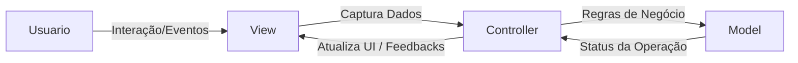
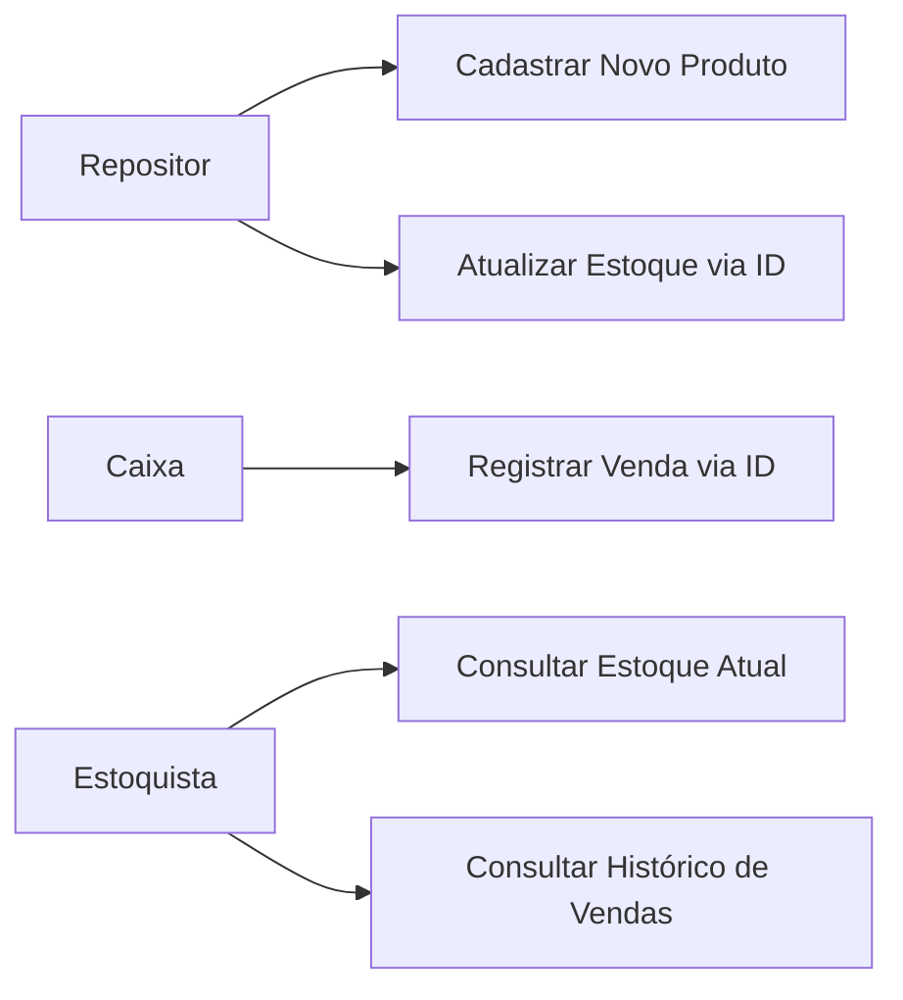
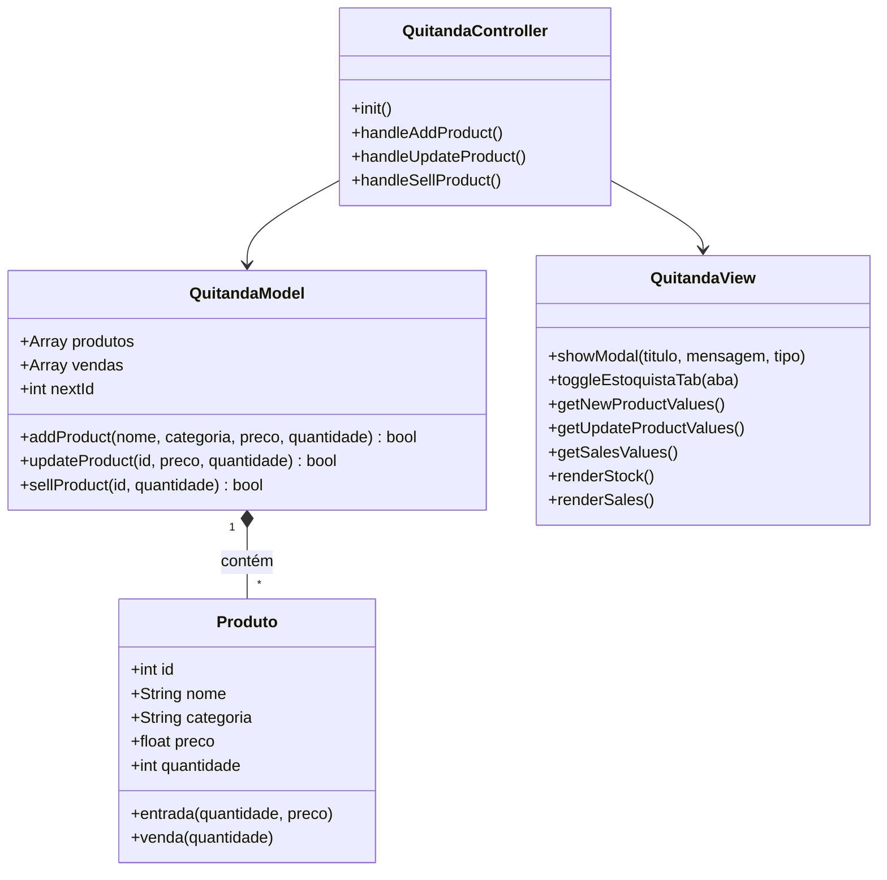
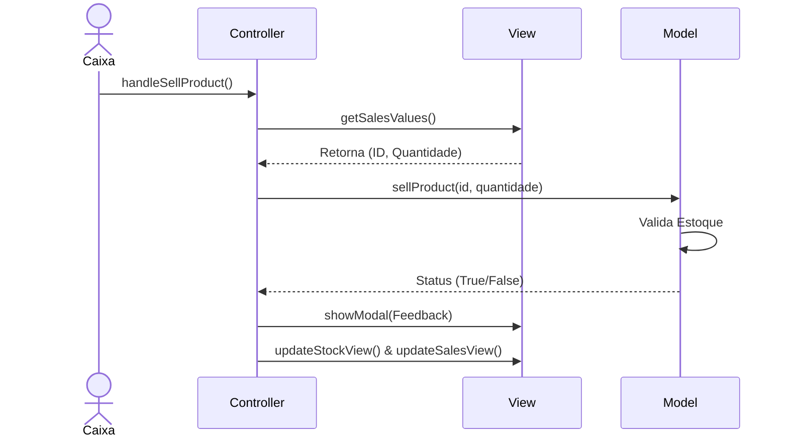
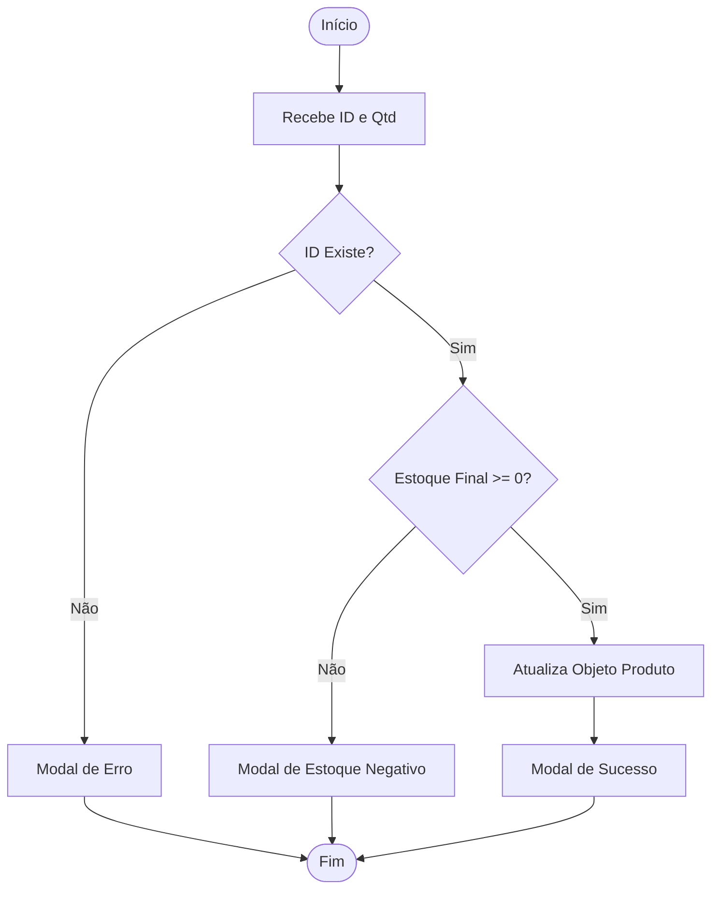
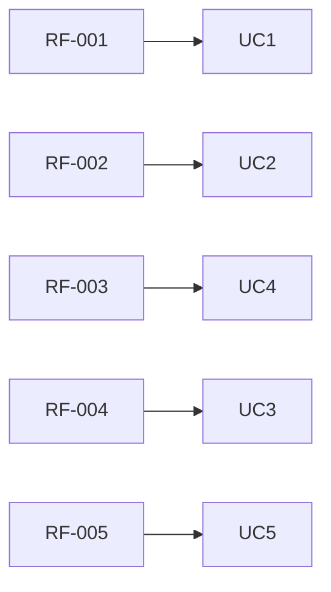

# Documentação de Especificações de Requisito de Software (SRS - Software Requirement Specification)

Documento Baseado na ISO/IEC/IEEE 29148:2018

**Sistema de Controle de Quitanda (Quitanda MVC)**

**Padrão:** ISO/IEC/IEEE 29148:2018  
**Versão:** 1.1.0  
**Data:** 2026-05-05  
**Autores:** EdxzyLuksz, GuizineRa e Liphyzz

## 1. Introdução

### 1.1 Propósito

Este documento descreve requisitos do sistema Quitanda MVC, com objetivo de:

- Definir de forma clara as funcionalidades e limites da aplicação web.
- Padronizar o entendimento entre stakeholders e a equipe de desenvolvimento.
- Servir como base oficial para desenvolvimento, manutenção e testes de validação.

### 1.2 Escopo

O sistema permitirá o gerenciamento completo e seguro de uma quitanda de pequeno porte, incluindo:

- Registro autônomo de novos produtos com categorias pré-definidas;
- Atualização de estoque de produtos existentes através de ID (permitindo adições para reposição e subtrações para perdas/quebras);
- Registro de vendas de produtos deduzindo automaticamente do estoque via ID;
- Visualização limpa do estoque atual e do histórico financeiro via sistema de abas;
- Feedbacks visuais interativos através de Modais customizados, substituindo alertas genéricos.

O sistema será uma aplicação web front-end utilizando:

- HTML5 e CSS3
- JavaScript (ES6 Modules)
- Arquitetura MVC (Model-View-Controller)
- Estrutura POO (Programação Orientada a Objetos)

### 1.3 Definições

**Termo** | **Definições**
---|---
**Produto** | Item Comercializado na quitanda (ex: Frutas, Legumes).
**Cadastro** | Registro inicial de um produto inédito no sistema.
**Atualização** | Ajuste no estoque (positivo ou negativo) ou preço de um item já existente.
**Venda** | Registro de saída de produto gerando histórico financeiro.
**Estoque** | Quantidade disponível de um produto cadastrado.
**Modal** | Janela sobreposta na interface usada para alertas e feedbacks amigáveis.
**ID** | Identificador numérico único gerado para cada produto.

**Acrônimos**

- SGQ - Sistema de Gerenciamento de Quitanda
- RF - Requisito Funcional
- RNF - Requisito Não Funcional
- MVC - Model-View-Controller
- POO - Programação Orientada a Objetos

### 1.4 Visão Geral do Documento

Este documento está organizado em:

- Introdução e visão geral
- Descrição do Sistema
- Requisitos detalhados
- Regras de Negócio
- Modelos do Sistema (UML e Fluxos)
- Análise de Risco e Controle de Versão

## 2. Descrição Geral do Sistema

### 2.1 Perspectiva do Sistema

O sistema é standalone (front-end client-side), operado inteiramente no navegador, seguindo rigorosamente a arquitetura MVC para separar a lógica de dados da interface visual.

### 2.2 Funções do Sistema

O Sistema deve:

- Cadastrar novos produtos garantindo nomes únicos.
- Atualizar estoque (+ para repor, - para quebras/perdas) e preços utilizando o ID.
- Registrar vendas via ID, validando se há estoque suficiente.
- Impedir operações matemáticas impossíveis (ex: estoque final negativo).
- Alternar visualizações (Abas) e exibir Modais de feedback.

### 2.3 Classes de usuários

| Usuários | Descrição |
|----------|-----------|
| Estoquista | Consulta o estoque atual e o histórico de vendas. |
| Caixa | Realiza as vendas dos produtos através do ID. |
| Repositor | Registra a entrada de novos produtos e atualiza o estoque existente. |

### 2.4 Ambiente Operacional

Navegadores Web Modernos (Chrome, Firefox, Edge, Safari) com suporte a módulos ES6.

### 2.5 Restrições

- Não utiliza Banco de Dados externo (persistência na memória do navegador).
- Dados armazenados na memória RAM (voláteis ao recarregar a página).
- Sem autenticação ou controle de acesso de Usuário (login).

### 2.6 Suposições

- O usuário possui conhecimentos básicos de operação de sistemas web.
- Volume de dados é pequeno (adequado para processamento via client-side).

## 3. Requisitos do Sistema

### 3.1 Requisitos Funcionais

**RF-001: Cadastro de Novo Produto**

**Descrição:** Permitir ao Repositor cadastrar um produto inédito.

**Prioridade:** Alta | **Versão:** 1.1 | **Rastreabilidade:** Stakeholder 001

**Critérios de Aceitação:**

- [ ] Entrada de Dados: Nome, Categoria (Menu Dropdown), Preço Unitário, Quantidade Inicial.
- [ ] Validação: Bloquear campos vazios, valores não numéricos e números negativos.
- [ ] Verificação de Duplicidade: Bloquear produtos com nomes já existentes.
- [ ] Saída: Modal de Sucesso ou Erro.

**RF-002: Atualizar Estoque (Produto Existente)**

**Descrição:** Permitir ao Repositor adicionar/remover quantidades e atualizar o preço de um item já existente.

**Prioridade:** Alta | **Versão:** 1.1 | **Rastreabilidade:** Stakeholder 002

**Critérios de Aceitação:**

- [ ] Entrada de Dados: ID do Produto, Novo Preço (Opcional), Quantidade (Aceita + ou -).
- [ ] Validação: Verificar se o ID existe na base de dados.
- [ ] Regra de Cálculo: Permitir subtração (-), desde que o estoque final não fique menor que 0.
- [ ] Saída: Modal de Sucesso ou Erro.

**RF-003: Listagem de Estoque e Sistema de Abas**

**Descrição:** Permitir ao Estoquista visualizar os produtos em estoque.

**Prioridade:** Alta | **Versão:** 1.1 | **Rastreabilidade:** Stakeholder 003

**Critérios de Aceitação:**

- [ ] Exibir lista formatada com ID, Nome, Categoria, Preço formatado (R$) e Quantidade.
- [ ] Utilizar sistema de Toggle (Abas) para ocultar a lista de vendas ao exibir o estoque e vice-versa.

**RF-004: Registro de Vendas**

**Descrição:** Permitir ao Caixa vender produtos e gerar histórico.

**Prioridade:** Alta | **Versão:** 1.1 | **Rastreabilidade:** Stakeholder 004

**Critérios de Aceitação:**

- [ ] Entrada de Dados: ID do Produto e Quantidade Vendida.
- [ ] Validação: Bloquear operação se a quantidade solicitada exceder o estoque disponível.
- [ ] Atualização: Subtrair automaticamente a quantidade do estoque da classe Model.
- [ ] Saída: Modal de venda concluída.

**RF-005: Histórico de Movimentações (Vendas)**

**Descrição:** Permitir a consulta do registro das transações realizadas.

**Prioridade:** Média | **Versão:** 1.1 | **Rastreabilidade:** Stakeholder 005

**Critérios de Aceitação:**

- [ ] Exibir lista contendo: Número da operação, Quantidade, Nome do Produto e Valor Total.
- [ ] Integrado ao sistema de Abas do RF-003.

### 3.2 Requisitos Não Funcionais

**RNF-001: Usabilidade e UI/UX**

**Descrição:** Interface responsiva com feedbacks visuais claros (botões afundados em abas ativas) e uso de modais HTML/CSS para notificações, abolindo alertas nativos do navegador.

**RNF-002: Desempenho**

**Descrição:** Respostas e transições de tela em tempo real, executadas em menos de 1 segundo.

**RNF-003: Arquitetura MVC**

**Descrição:** Estruturação rígida do código em MVC e uso de módulos JavaScript (import/export).

## 4. Regras do Negócio

| Regras de Negócio | Descrição |
|-------------------|-----------|
| RN-001 | A quantidade em estoque de um produto NUNCA pode ser negativa. |
| RN-002 | O preço de um produto cadastrado não pode ser negativo. |
| RN-003 | Nomes de novos produtos devem ser únicos (bloqueio de duplicidade). |
| RN-004 | Vendas e Atualizações devem ser feitas OBRIGATORIAMENTE via ID, garantindo integridade. |
| RN-005 | O repositor pode dar baixa no estoque usando números negativos (ex: -3), respeitando a RN-001. |

## 5. Modelos do Sistema

### 5.1 Diagrama de Casos de Uso

O que o sistema deve fazer do ponto de vista do usuário:

### 5.2 Diagrama de Classes UML

Estrutura da aplicação, classes, atributos e métodos:

### 5.3 Diagrama de Sequência

Interação de objetos na operação do Caixa (Venda):

### 5.4 Diagrama de Atividades

Fluxo da Atualização de Estoque:

## 6. Análise de Risco

### 6.1 Matriz de Análise de Risco

| Risco | Impacto | Mitigação Implementada/Sugerida |
|-------|---------|---------------------------------|
| Perda de Dados | Alto | O sistema roda em RAM. Sugere-se uso futuro de localStorage. |
| Erro Operacional Humano | Médio | Separação física de Cadastro/Atualização e obrigação de uso do ID. |
| Entrada de Dados Inválidos | Baixo | Travas no Model e Controller (Validação isNaN, <, >= 0). |

## 7. Controle de Versão

### 7.1 Histórico de Alterações

| Versão | Data | Autor(es) | Modificação |
|--------|------|-------|-------------|
| 1.0.0 | 2026-04-14 | EdxzyLuksz, Liphyzz e GuizineRa | Versão Inicial. |
| 1.1.0 | 2026-05-05 | EdxzyLuksz | Separação de CRUD (Create/Update), uso obrigatório de ID, permissão de perdas (-), Modais UI e Abas. |

### 7.2 Aprovações

| Papel | Nome | Data | Assinatura |
|-------|------|------|------------|
| Stakeholder | Diogo | 2026-05-05 | [ ] |

### 7.3 Rastreabilidade

Relacionamento estrutural das demandas e requisitos:

