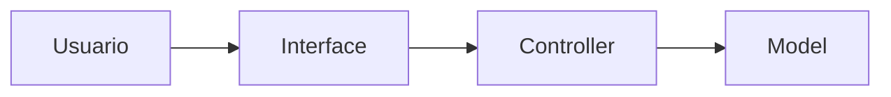
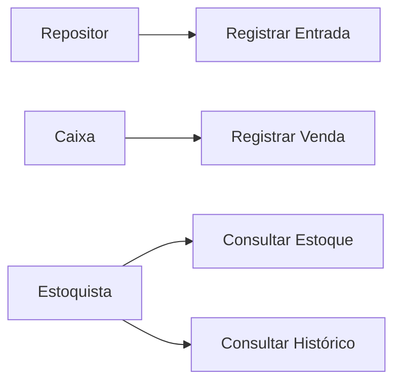
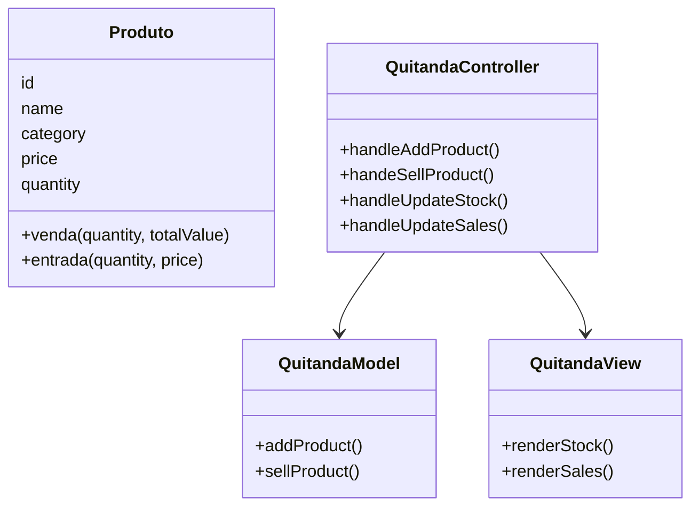
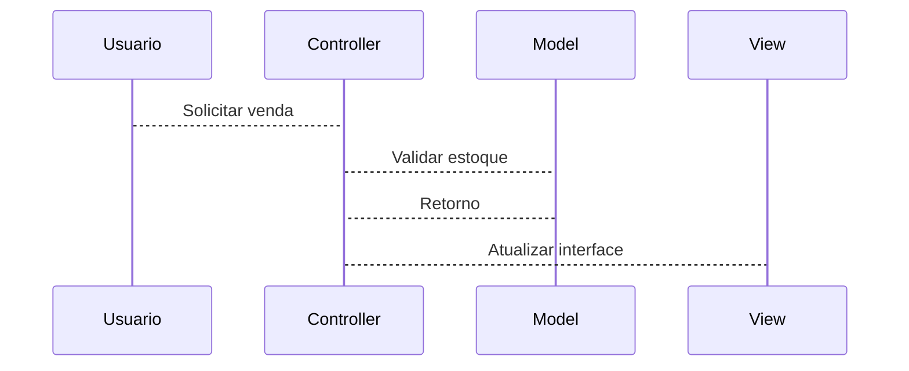
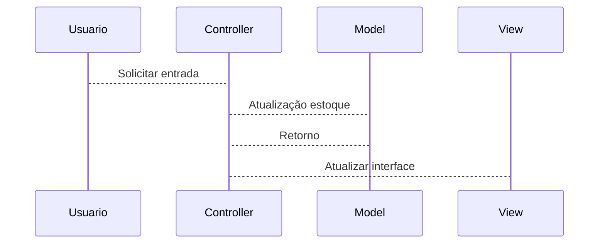
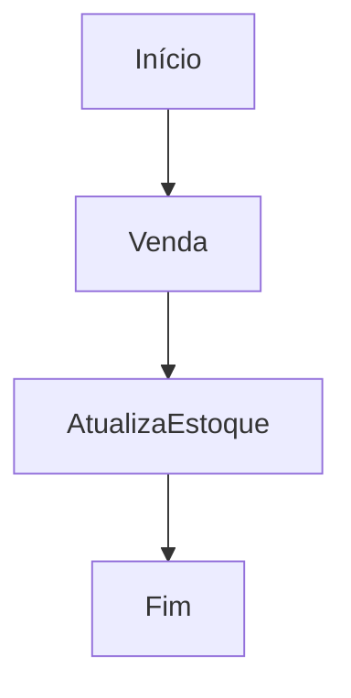
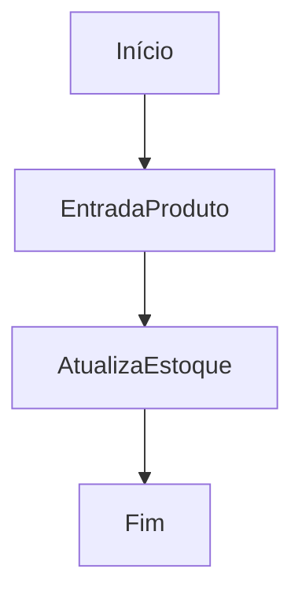
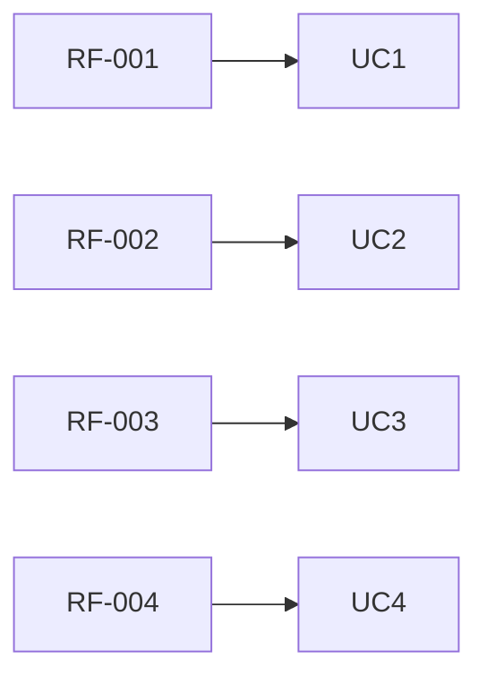

# Documentação de Especificações de Requisito de Software (SRS - Software Requirement Specification)

Documento Baseado na ISO/IEEE 29148:2018

## Sistema de Controle de Quitanda (Quitanda MVC)

**Padrão:** ISO//IEC/IEEE 29148:2018
**Versão:** 1.0.0
**Data:** 2026-04-14
**Autores:** EdxzyLuksz, GuizineRa e Liphyzz

---

## 1. Introdução

### 1.1 Propósito

Este documento descreve requisitos do sistema **Quitanda MVC**, com objetivo de:

* Definir funcionalidades
* Padronizar entendimento entre stakeholders
* Servir como base para desenvolvimento e testes

---

### 1.2 Escopo

O sistema permitirá:

* Registro de entrada de produto;
* Registro de vendas;
* Controle de estoque;
* Histórico de movimentações;

O sistema será uma aplicação web front-end utilizando:

* HTML
* CSS
* JavaScript
* Arquitetura MVC
* Estrutura POO

---

### 1.3 Definições

| Termo | Definições |
| --- | --- |
| Produto | Item Comercializado na quitanda |
| Entrada | Registro de chegada de produto |
| Venda | Registro de saída de produto |
| Estoque | Quantidade disponível de produto |

Acrônimos

* **SGQ** - Sistema de Gerenciamento de Quitanda
* **RF** - Requisito Funcional
* **RNF** - Requisito Não Funcional

---

### 1.4 Visão Geral do Documento

Este documento está organizado em:

* Introdução e visão geral
* Descrição do Sistema
* Requisitos detalhados
* Modelos UML
* Regras de Negócio

---

## 2. Descrição Geral do Sistema

### 2.1 Perspectiva do Sistema

O sistema é standalone (front-end), operado em navegador

---

### 2.2 Funções do Sistema

O Sistema deve:

* Cadastrar produtos
* Atualizar estoque
* Registrar vendas
* Validar operações
* Exibir dados

---

### 2.3 Classes de usuários

| Usuários | Descrição |
| --- | --- |
| Estoquista | Gerencia estoque |
| Caixa | Realiza vendas |
| Repositor | Registra entradas |

---

### 2.4 Ambiente Operacional

* Navegador Web (Chrome, Firefox, Edge)

---

### 2.5 Restrições

* Não utiliza Banco de Dados
* Dados armazenados na memória
* Sem autenticação de Usuário

### 2.6 Suposições

* Usuário possui conhecimentos básicos de informática
* Volme de dados pequeno

---

## 3. Requisitos do Sistema

### 3.1 Requisitos Funcionais

#### RF-001: Cadastro de Produto

**Descrição:** Permitir cadastrar um produto

* **Prioridade:** Alta
* **Versão:** 1.0
* **Data:** 2026-04-14
* **Rastreabilidade:** Necessidade do Stakeholder 001

**Critérios de Aceitação:**

* [ ] Entrada de Dados: Nome, Categoria, Preço, Quantidade
* [ ] Validação de Campos
* [ ] Verificação de Duplicidade
* [ ] Saída: Notificação ao Usuário

---

#### RF-002: Atualizar Estoque

**Descrição:** Permitir atualização de dados de itens existentes

* **Prioridade:** Alta
* **Versão:** 1.0
* **Data:** 2026-04-14
* **Rastreabilidade:** Necessidade do Stakeholder 002

**Critérios de Aceitação:**

* [ ] Verificar se item já está cadastrado
* [ ] Entrada de Dados: Nome, Categoria, Preço, Quantidade
* [ ] Validação de Campos
* [ ] Saóda: Notificação ao Usuário

---

#### RF-003: Listagem de Estoque

**Descrição:** Exibir informações dos produtos cadastrados

**Prioridade:** Alta
**Versão:** 1.0
**Data:** 2026-04-14
**Rastreabilidade:** Necessidade do Stakeholder 003

**Critérios de Aceitação:**

* [ ] Listagem dos produtos
* [ ] Saída: ID,Nome, Categoria, Preço, Quantidade

---

#### RF-004: Registro de Vendas

**Descrição:** Permitir vender produtos

**Prioridade:** Alta
**Versão:** 1.0
**Data:** 2026-04-14
**Rastreabilidade:** Necessidade do Stakeholder 004

**Critérios de Aceitação:**

* [ ] Venda de produtos cadastro
* [ ] Verificação de quantidade
* [ ] Atualização do estoque
* [ ] Notificação de venda realizada

---

#### RF-005: Histórico de Movimentações

**Descrição:** Permitir o Registro de Movimentações (Entrada e Saída) de Produtos

**Prioridade:** Média
**Versão:** 1.0
**Data:** 2026-04-14
**Rastreabilidade:** Necessidade do Stakeholder 005

**Critérios de Aceitação:**

* [ ] Registro das movimentações em uma lista
* [ ] Consulta das movimentações
* [ ] Verificção de duplicidade
* [ ] Saída: Notificação ao usuário

---

### 3.2 Requisitos Não Funcionais

#### RNF-001: Usabilidade

**Descrição:** Interdace simples e intuitiva

---

#### RNF-002: Desempenho

**Descrição:** Respostas rápidas e inferiores a 1 segundo

---

#### RNF-003: Arquitetura MVC

**Descrição:** Estruturação da arquitetura do código em MVC

---

## 4. Regras do Negócio

| Regras de Negócio | Descrição |
| --- | --- |
| RN-001 | Quantidade de produtos não pode ser negativa |
| RN-002 | Preço do produto não pode ser negativo |
| RN-003 | Nome do produto é obrigatório |
| RN-004 | Venda só pode ser realizada se estoque for suficiente |
| RN-005 | Toda movimentação deve ser registrada |

---

Podem existir restrições para o negócio (legais, movimentação, local)

## 5. Modelos do Sistema

### 5.1 Diagrama de Casos de Uso

O que o sistema deve fazer do ponto de vista do usuário

### 5.2 Diagrama de Classes UML

Estrutura do código, classes, atributos e métodos

---

### 5.3 Diagrama de Sequência

Interação entre objetos ao longo do tempo para realização de uma funcionalidade específica

#### 5.3.1 Venda

#### 5.3.2 Atualização de Estoque

### 5.4 Diagrama de Atividades

Diagrama de Atividades: Fluxo de atividades para realização de uma funcionalidade específica

#### 5.4.1  Venda

#### 5.4.1  Entrada

---

## 6. Análise de Risco

### 6.1 Matriz de Análise de Risco

| Risco | Impacto | Mitigação |
| --- | --- | --- |
| Perda de Dados | Alto | usar localStorage |
| Entrada de Dados | Médio | validar as Entradas de dados |

---

## 7. Controle de Versão

### 7.1 Histórico de Alterações

| Versão | Data | Autor | Modificação |
| --- | --- | --- | --- |
| 1.0.0 | 2026-04-14 | EdxzyLuksz | Versão Inicial |

### 7.2 Aprovações

| Papel | Nome | Data | Assinatura |
| --- | --- | --- | --- |
| Stakeholder | João Silva | 2026-04-15 | [ ] |

### 7.3 Rastreabilidade

Relacionamento entre requisitos, casos de uso, textos e códigos

